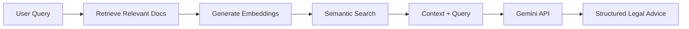

# ⚖️ LexAI - Legal RAG Advisor

<div align="center">


**An AI-powered legal advisory system with Retrieval-Augmented Generation (RAG) capabilities**

[](https://react.dev/)
[](https://www.typescriptlang.org/)
[](https://vitejs.dev/)
[](https://ai.google.dev/)

</div>

---
**Demo Link** : https://legal-rag-2.vercel.app/

## 📋 Overview

LexAI is a sophisticated legal advisory application that combines the power of Google's Gemini AI models with a Retrieval-Augmented Generation (RAG) system. It enables users to:

- 📝 Ask legal questions and receive AI-powered analysis
- 📚 Upload and index legal documents for context-aware responses
- 💬 Maintain persistent chat sessions with dynamic titles
- 🔍 Retrieve relevant legal precedents and statutory information
- 📱 Access the application on any device with responsive design

## ✨ Key Features

### 🤖 AI-Powered Legal Analysis
- **Multi-Model Support**: Utilizes Google Gemini Flash, Pro, and Thinking models
- **Structured Responses**: Provides legal opinions, case references, statutory interpretations, risk assessments, and recommended actions
- **Context-Aware**: Leverages uploaded documents for more accurate and relevant advice

### 📄 Document Management
- **Real-Time Ingestion**: Upload legal documents (.txt, .md, .pdf, .json) for instant indexing
- **Vector Storage**: Documents are embedded and stored for efficient semantic search
- **Knowledge Base**: View and manage all indexed documents from the sidebar

### 💬 Dynamic Chat Sessions
- **Persistent History**: All conversations are saved in localStorage
- **Auto-Generated Titles**: Chat sessions automatically receive descriptive titles
- **Session Management**: Switch between chats, create new inquiries, and view chat previews
- **Infinite Scroll**: Load older chats seamlessly as you scroll

### 🎨 Modern UI/UX
- **Dark Theme**: Sleek slate and emerald color scheme optimized for extended use
- **Mobile-First**: Fully responsive with hamburger menu and slide-in sidebar on mobile
- **Smooth Animations**: Polished transitions and micro-interactions
- **Accessibility**: Semantic HTML and ARIA-compliant components

## 🛠️ Tech Stack

### Frontend
- **React 18** - Component-based UI library
- **TypeScript** - Type-safe development
- **Vite** - Fast build tool and dev server
- **Tailwind CSS** - Utility-first styling
- **Lucide React** - Beautiful icon set

### AI & Backend Services
- **Google Gemini API** - Advanced language models
- **RAG System** - Custom vector storage and retrieval
- **localStorage** - Client-side persistence

## 🚀 Getting Started

### Prerequisites

- **Node.js** (v18 or higher)
- **npm** or **yarn**
- **Google Gemini API Key** ([Get one here](https://ai.google.dev/))

### Installation

1. **Clone the repository**
   ```bash
   git clone https://github.com/yourusername/lexai---legal-rag-advisor.git
   cd lexai---legal-rag-advisor
   ```

2. **Install dependencies**
   ```bash
   npm install
   ```

3. **Configure environment variables**
   
   Create a `.env` file in the root directory:
   ```env
   VITE_GEMINI_API_KEY=your_gemini_api_key_here
   ```

4. **Start the development server**
   ```bash
   npm run dev
   ```

5. **Open your browser**
   
   Navigate to `http://localhost:5173`

## 📁 Project Structure

```
lexai---legal-rag-advisor/
├── src/
│   ├── components/          # React components
│   │   ├── Sidebar.tsx      # Navigation and document management
│   │   ├── Header.tsx       # Top navigation bar
│   │   ├── ChatInput.tsx    # Legal query input
│   │   ├── ChatMessage.tsx  # Message display
│   │   ├── LoginForm.tsx    # Authentication UI
│   │   └── SettingsModal.tsx # User settings
│   ├── services/            # Business logic and API calls
│   │   ├── geminiService.ts # Google Gemini API integration
│   │   ├── ragService.ts    # RAG vector storage and retrieval
│   │   ├── chatService.ts   # Chat session management
│   │   └── authService.ts   # User authentication
│   ├── types.ts             # TypeScript type definitions
│   ├── App.tsx              # Main application component
│   ├── index.css            # Global styles and Tailwind config
│   └── main.tsx             # Application entry point
├── public/                  # Static assets
├── .env                     # Environment variables (not committed)
├── .gitignore              # Git ignore rules
├── package.json            # Project dependencies
├── tsconfig.json           # TypeScript configuration
├── vite.config.ts          # Vite build configuration
└── README.md               # This file
```

## 💡 Usage

### 1. **User Authentication**
- Sign up or log in with your credentials
- Choose your role: Client, Lawyer, or Legal Researcher

### 2. **Upload Legal Documents**
- Click the upload icon in the Knowledge Base section
- Select `.txt`, `.md`, `.pdf`, or `.json` files
- Documents are automatically indexed and embedded

### 3. **Ask Legal Questions**
- Type your legal scenario or question in the input box
- Select a Gemini model (Flash for speed, Pro for depth, Thinking for complex reasoning)
- Click "Get Legal Analysis" to receive AI-powered insights

### 4. **Review Analysis**
- **Legal Opinion**: Expert interpretation of your scenario
- **Case References**: Relevant precedents and citations
- **Statutory Interpretation**: Applicable laws and regulations
- **Risk Assessment**: Potential legal risks and considerations
- **Recommended Actions**: Practical next steps and advice

### 5. **Manage Chat Sessions**
- View all past inquiries in the sidebar
- Click on any chat to load the conversation
- Start a new inquiry with the "New Inquiry" button

## 🧠 RAG System

LexAI's Retrieval-Augmented Generation (RAG) system enhances AI responses by:

1. **Document Ingestion**: Parsing and chunking uploaded legal documents
2. **Embedding Generation**: Creating vector representations using Gemini embeddings
3. **Semantic Search**: Finding relevant document chunks based on user queries
4. **Context Injection**: Providing retrieved context to the AI model for informed responses

### How It Works



## 🔧 Development

### Build for Production
```bash
npm run build
```

### Preview Production Build
```bash
npm run preview
```

### Lint Code
```bash
npm run lint
```

## 🌐 API Configuration

The application uses the **Google Gemini API** for:
- Text generation (`gemini-1.5-flash`, `gemini-1.5-pro`, `gemini-2.0-flash-thinking-exp`)
- Text embeddings (`text-embedding-004`)

Ensure your API key has access to these models.

## 🔒 Privacy & Security

- **Local Storage**: All chat history and documents are stored locally in your browser
- **No Backend**: The application runs entirely client-side
- **API Key Security**: Your Gemini API key is stored in environment variables (never commit `.env` to version control)

## 🤝 Contributing

Contributions are welcome! Please follow these steps:

1. Fork the repository
2. Create a feature branch (`git checkout -b feature/amazing-feature`)
3. Commit your changes (`git commit -m 'Add amazing feature'`)
4. Push to the branch (`git push origin feature/amazing-feature`)
5. Open a Pull Request

## 📄 License

This project is licensed under the MIT License - see the LICENSE file for details.

## 🙏 Acknowledgments

- **Google Gemini** for providing powerful AI models
- **React** and **Vite** communities for excellent tooling
- **Tailwind CSS** for the utility-first CSS framework
- **Lucide** for beautiful, customizable icons

## 📞 Support

For questions, issues, or feedback:
- Open an issue on GitHub
- Contact the development team

---

<div align="center">

**Built with ⚖️ by the LexAI Team**

</div>
